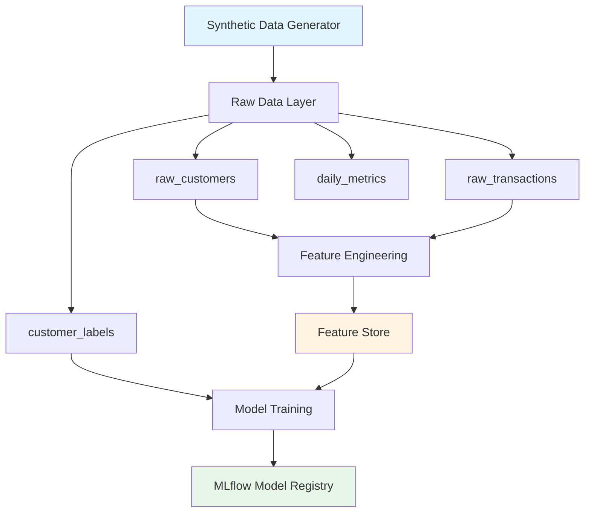
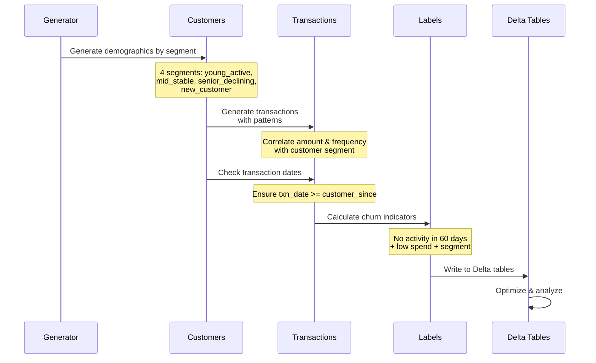
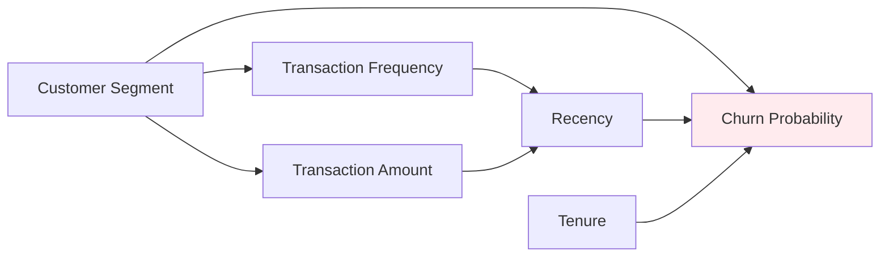
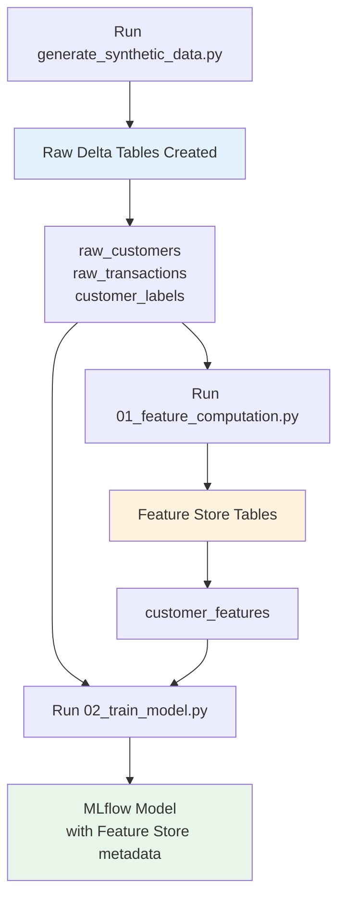

# Synthetic Data Generation for Feature Store

## Overview

This guide explains how to generate realistic synthetic data for the Azure Databricks Feature Store application. The synthetic data generator creates:

- **Customer demographics** with realistic age distributions and tenure
- **Transaction history** with temporal patterns and correlations
- **Churn labels** based on logical business rules
- **Time-series metrics** for monitoring and trend analysis

## Architecture



## Data Generation Workflow



## Customer Segmentation Logic

The generator creates four customer segments with different characteristics:

| Segment | Distribution | Age Range | Tenure | Transaction Behavior | Churn Risk |
|---------|-------------|-----------|--------|---------------------|------------|
| **young_active** | 25% | 23-33 | 6mo-2yr | High frequency, medium spend | Low |
| **mid_stable** | 40% | 34-50 | 2-5yr | Medium frequency, high spend | Low |
| **senior_declining** | 20% | 51-65 | 3-7yr | Low frequency, medium spend | High |
| **new_customer** | 15% | 25-45 | 0-3mo | Low-medium frequency, low spend | Medium |

## Feature Correlations

The synthetic data includes realistic correlations:



## Project Structure

```
src/
├── synthetic_data_generator.py    # Core generator logic
└── utils/
    └── data_validation.py         # Validation utilities

notebooks/
├── generate_synthetic_data.py     # Main data generation notebook
└── 01_feature_computation_updated.py  # Updated feature computation

config/
└── data_generation.yaml           # Generation parameters
```

## Installation

### Add to requirements.txt

```txt
faker==24.0.0
```

### Install in Databricks

```python
%pip install faker==24.0.0
dbutils.library.restartPython()
```

## Quick Start

### 1. Generate Small Dataset (Development)

```python
from synthetic_data_generator import generate_dataset

# Generate 1,000 customers with ~10 transactions each
data = generate_dataset(size='small')

# Access dataframes
customers = data['customers']      # Demographics
transactions = data['transactions']  # Transaction history
labels = data['labels']             # Churn labels
time_series = data['time_series']   # Daily aggregates
```

### 2. Generate Medium Dataset (Testing)

```python
from synthetic_data_generator import SyntheticDataGenerator, DataConfig

config = DataConfig(
    num_customers=10_000,
    avg_transactions_per_customer=15,
    date_range_days=365,
    churn_rate=0.15,
    seed=42
)

generator = SyntheticDataGenerator(config)
customers, transactions, labels = generator.generate_all()
```

### 3. Generate Large Dataset (Production Testing)

```python
config = DataConfig(
    num_customers=100_000,
    avg_transactions_per_customer=20,
    date_range_days=730
)

generator = SyntheticDataGenerator(config)
customers, transactions, labels = generator.generate_all()

# Add realistic data quality issues
customers_corrupted, transactions_corrupted = generator.add_data_quality_issues(
    customers, transactions, corruption_rate=0.02
)
```

## Running in Databricks

### Step 1: Upload Generator Module

1. Add `synthetic_data_generator.py` to your repository under `src/`
2. Commit and push to GitHub
3. Sync Databricks Repos

### Step 2: Run Generation Notebook

```bash
# From Databricks CLI
databricks workspace import generate_synthetic_data.py \
  /Workspace/Repos/your-repo/notebooks/ \
  --format=SOURCE --language=PYTHON

# Or use the Databricks UI to import the notebook
```

### Step 3: Configure Parameters

In the Databricks notebook UI, set widgets:

- **data_size**: `small` | `medium` | `large`
- **catalog**: `ml` (or your catalog name)
- **schema**: `churn_raw` (raw data schema)
- **add_corruption**: `false` | `true`

### Step 4: Execute Notebook

The notebook will:
1. Create catalog and schema
2. Generate synthetic data
3. Validate data quality
4. Write to Delta tables
5. Optimize tables
6. Generate data quality report

## Integration with Feature Store

### Update Feature Computation Notebook

Modify `01_feature_computation.py` to read from synthetic data:

```python
# OLD: Hardcoded sample data
# customers_data = [Row(...), Row(...)]
# customers_df = spark.createDataFrame(customers_data)

# NEW: Read from Delta tables
customers_df = spark.table(f"{catalog}.churn_raw.raw_customers")
transactions_df = spark.table(f"{catalog}.churn_raw.raw_transactions")
```

### Update Training Notebook

Modify `02_train_model.py` to use synthetic labels:

```python
# OLD: Hardcoded labels
# labels_data = [Row(...), Row(...)]

# NEW: Read from Delta table
labels_df = spark.table(f"{catalog}.churn_raw.customer_labels")
```

### Data Flow Diagram



## Data Validation

### Built-in Quality Checks

The generator includes validation at multiple stages:

**Customer Data:**
```python
# Age validation
assert 18 <= age <= 100
assert age is not None

# Date validation
assert customer_since_date <= today
assert customer_since_date >= today - date_range_days
```

**Transaction Data:**
```python
# Amount validation
assert amount >= 0
assert amount <= 5000

# Date validation
assert transaction_date >= customer_since_date
assert transaction_date <= today
```

**Referential Integrity:**
```python
# Every transaction must have valid customer
assert transaction.customer_id in customers.customer_id.values

# Every label must have corresponding customer
assert label.customer_id in customers.customer_id.values
```

### Custom Validation

Add your own validation in `01_feature_computation_updated.py`:

```python
# Check for data quality issues
null_customers = customers_df.filter(col("age").isNull()).count()
if null_customers > 0:
    print(f"WARNING: {null_customers} customers with null ages")
    # Handle nulls...

invalid_ages = customers_df.filter(
    (col("age") < 18) | (col("age") > 100)
).count()
if invalid_ages > 0:
    print(f"WARNING: {invalid_ages} customers with invalid ages")
    # Handle invalid data...
```

## Testing Data Quality Issues

### Generate Corrupted Data

Test your validation logic by introducing known issues:

```python
# Add 3% corruption rate
customers_bad, transactions_bad = generator.add_data_quality_issues(
    customers_df, 
    transactions_df, 
    corruption_rate=0.03
)

# Issues introduced:
# - Null ages (~1.5% of customers)
# - Invalid ages (>100 or <0) (~1.5% of customers)
# - Negative transaction amounts (~3% of transactions)
```

### Verify Validation Catches Issues

```python
# Your feature computation should catch these:
null_count = customers_bad['age'].isna().sum()
assert null_count > 0, "Corruption should introduce nulls"

# Run validation
try:
    validate_features(features_df)  # Should fail
    assert False, "Validation should have failed"
except ValueError as e:
    print(f"✅ Validation correctly caught issue: {e}")
```

## Monitoring Data Quality

### Data Quality Dashboard Query

```sql
-- Customer data quality
SELECT 
    COUNT(*) as total_customers,
    SUM(CASE WHEN age IS NULL THEN 1 ELSE 0 END) as null_ages,
    SUM(CASE WHEN age < 18 OR age > 100 THEN 1 ELSE 0 END) as invalid_ages,
    AVG(age) as avg_age,
    MIN(customer_since_date) as earliest_customer,
    MAX(customer_since_date) as latest_customer
FROM ml.churn_raw.raw_customers;

-- Transaction data quality
SELECT 
    COUNT(*) as total_transactions,
    SUM(CASE WHEN amount < 0 THEN 1 ELSE 0 END) as negative_amounts,
    SUM(CASE WHEN amount > 10000 THEN 1 ELSE 0 END) as suspicious_high,
    AVG(amount) as avg_amount,
    SUM(amount) as total_revenue,
    MIN(transaction_date) as first_txn,
    MAX(transaction_date) as last_txn
FROM ml.churn_raw.raw_transactions;
```

### Feature Drift Detection

```python
# Compare current vs previous feature distributions
current_features = fe.read_table(name=f"{catalog}.{schema}.customer_features")
current_stats = current_features.select("total_spend_30d").summary()

# Compare with historical baseline
baseline_avg_spend = 2500.0  # Historical average
current_avg_spend = current_stats.filter("summary == 'mean'").collect()[0][1]

drift_pct = abs(current_avg_spend - baseline_avg_spend) / baseline_avg_spend
if drift_pct > 0.20:
    print(f"⚠️ ALERT: Feature drift detected ({drift_pct:.1%})")
```

## Production Deployment

### Add to Databricks Asset Bundle

Update `databricks.yml`:

```yaml
resources:
  jobs:
    data_generation_job:
      name: "${bundle.target}-data-generation"
      schedule:
        quartz_cron_expression: "0 0 0 * * ?"  # Daily at midnight
        timezone_id: "UTC"
      
      tasks:
        - task_key: generate_data
          notebook_task:
            notebook_path: ./notebooks/generate_synthetic_data.py
            base_parameters:
              data_size: "medium"
              catalog: ${var.catalog}
              schema: "churn_raw"
              add_corruption: "false"
          job_cluster_key: data_cluster
```

### Add to CI/CD Pipeline

Update `.github/workflows/dev-deploy.yml`:

```yaml
- name: Generate synthetic data
  run: |
    databricks bundle run data_generation_job --target dev
    
- name: Verify data quality
  run: |
    databricks workspace export \
      /Workspace/verify_data_quality.py \
      --format SOURCE
```

## Configuration Management

### Data Generation Config File

Create `config/data_generation.yaml`:

```yaml
environments:
  dev:
    num_customers: 1000
    avg_transactions: 10
    date_range_days: 180
    churn_rate: 0.15
    add_corruption: false
    
  staging:
    num_customers: 10000
    avg_transactions: 15
    date_range_days: 365
    churn_rate: 0.15
    add_corruption: true  # Test validation
    corruption_rate: 0.02
    
  prod:
    num_customers: 100000
    avg_transactions: 20
    date_range_days: 730
    churn_rate: 0.15
    add_corruption: false
```

### Load Configuration

```python
import yaml

with open('config/data_generation.yaml', 'r') as f:
    config = yaml.safe_load(f)

env = 'dev'  # or get from parameter
env_config = config['environments'][env]

config = DataConfig(
    num_customers=env_config['num_customers'],
    avg_transactions_per_customer=env_config['avg_transactions'],
    date_range_days=env_config['date_range_days'],
    churn_rate=env_config['churn_rate']
)
```

## Advanced Use Cases

### Incremental Data Generation

Generate new data to append to existing tables:

```python
# Load existing max IDs
max_customer_id = spark.sql("""
    SELECT MAX(customer_id) as max_id 
    FROM ml.churn_raw.raw_customers
""").collect()[0].max_id

# Generate new customers starting from max_id + 1
generator = SyntheticDataGenerator(config)
# ... modify generator to start customer_id from max_customer_id + 1

# Append new data
new_customers.write.mode("append").saveAsTable("ml.churn_raw.raw_customers")
```

### Time-Series Simulation

Generate evolving data over time:

```python
import time

for month in range(12):
    # Generate data for current month
    config.date_range_days = 30
    generator = SyntheticDataGenerator(config)
    
    # Simulate customer behavior changes over time
    # ... adjust churn_rate, transaction patterns, etc.
    
    # Write monthly batch
    monthly_data = generator.generate_all()
    write_to_delta(monthly_data, mode="append")
    
    print(f"Generated month {month + 1}/12")
```

### A/B Testing Datasets

Generate different datasets for experimentation:

```python
# Control group: Current model features
control_data = generate_dataset(size='medium')

# Treatment group: Modified feature engineering
treatment_config = DataConfig(
    num_customers=10_000,
    avg_transactions_per_customer=20,  # Higher activity
    churn_rate=0.12  # Different churn pattern
)
treatment_generator = SyntheticDataGenerator(treatment_config)
treatment_data = treatment_generator.generate_all()
```

## Troubleshooting

### Issue: Out of Memory

**Problem:** Generator crashes with OOM error for large datasets

**Solution:**
```python
# Generate in batches
batch_size = 10_000
total_customers = 100_000

for batch in range(0, total_customers, batch_size):
    config = DataConfig(num_customers=batch_size, seed=batch)
    generator = SyntheticDataGenerator(config)
    batch_data = generator.generate_all()
    
    # Write batch to Delta
    write_batch(batch_data, mode="append")
```

### Issue: Unrealistic Data Distributions

**Problem:** Generated data doesn't match production patterns

**Solution:**
```python
# Analyze production data first
prod_stats = spark.sql("""
    SELECT 
        AVG(transaction_count) as avg_txns,
        STDDEV(transaction_count) as std_txns,
        AVG(spend) as avg_spend
    FROM production.customer_metrics
""")

# Calibrate generator to match
config = DataConfig(
    avg_transactions_per_customer=int(prod_stats.avg_txns),
    # ... adjust other parameters
)
```

### Issue: Slow Generation

**Problem:** Data generation takes too long

**Solution:**
```python
# Use vectorized operations
import numpy as np

# Instead of loop
ages = [generate_age() for _ in range(num_customers)]

# Use numpy vectorization
ages = np.random.normal(40, 10, num_customers).astype(int)
ages = np.clip(ages, 18, 80)
```

## Next Steps

1. **Generate your first dataset**: Run `generate_synthetic_data.py` with `size='small'`
2. **Verify data quality**: Check the generated tables in Databricks SQL
3. **Update notebooks**: Modify feature computation to use synthetic data
4. **Test end-to-end**: Run complete pipeline from data generation → features → model
5. **Production deployment**: Add data generation job to your Bundle configuration

## Additional Resources

- [Original Feature Store Guide](./README.md)
- [Data Validation Best Practices](https://docs.databricks.com/data-governance/unity-catalog/data-quality.html)
- [Delta Lake Time Travel](https://docs.databricks.com/delta/history.html)
- [Databricks Expectations](https://docs.databricks.com/workflows/delta-live-tables/expectations.html)